CUDA Path Tracer
================

**University of Pennsylvania, CIS 5650: GPU Programming and Architecture, Project 3**

  Veer Kakar
  * [LinkedIn](www.linkedin.com/in/VeerKakar), [personal website](https://veerkakar17.github.io/PortfolioWebsite)
* Tested on: Linux Fedora 44 (Dual Boot from Windows 11 Laptop), Intel Ultra 9 275HX, NVIDIA 5070 laptop

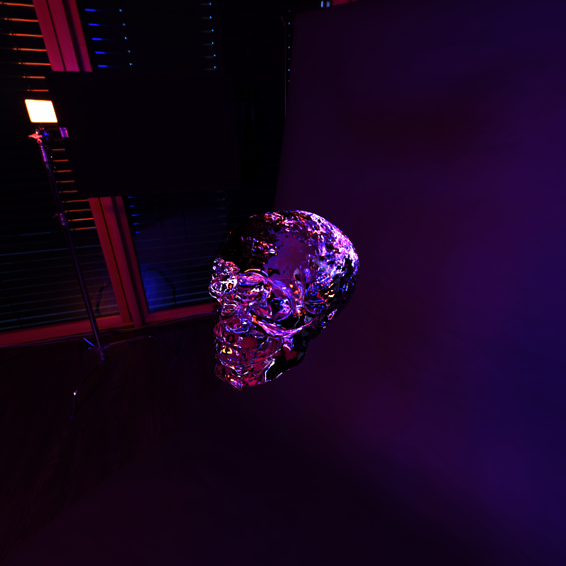

# Overview

This is a GPU-based Monte-Carlo Pathtracer created using CUDA C++ that renders images by simulating real-life light transport. This works by tracing rays of light emitted from light sources as they bounce around a scene and eventually reach the camera, except in reverse. 
This also supports custom glTF meshes, physically-based materials (rough/smooth dielectrics and metallics), Intel Open Image Denoiser, and more.

## Rendering Pipeline

The rendering pipeline goes through the following steps:
- **Ray Generation:** Generate one camera ray per each pixel, jittered within this for anti-aliasing. 
- **Intersection:** Test intersections with the scene (using BVH for triangles)
- **Sort & Compact:** Sort paths by material type to minimize warp divergence, and remove terminated paths (no bounces left, russian roulette, no intersection found).
- **Shading:** Shade each path by updating throughput and radiance based on material type hit (BSDF), NEE, and MIS.
- **Scattering:** Use BSDF to determine new ray direction for "bounce".  
- **Final Gather:** This accumulates the finished path's radiances, weighted by throughput, to the framebuffer for the render.

# Main Features 

## Pure Diffuse BSDF

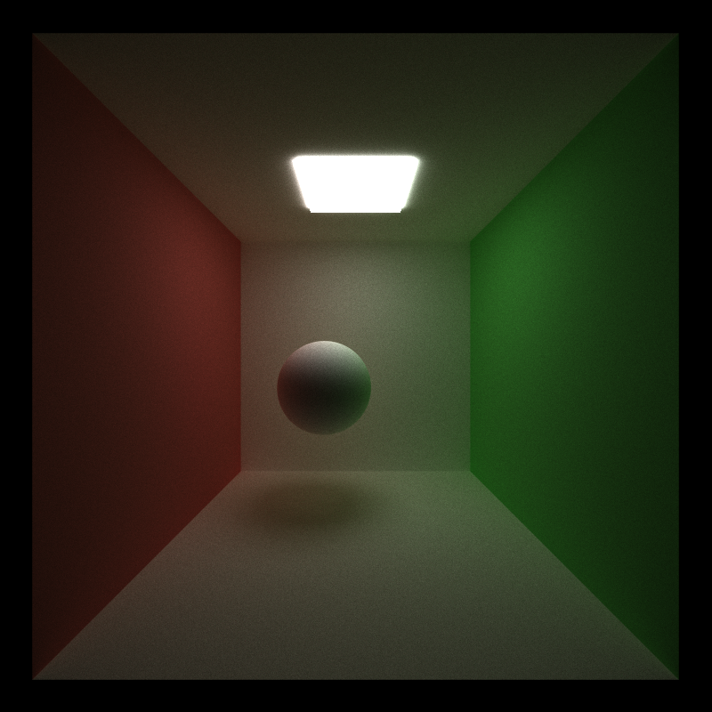
Pure diffuse sphere

This BSDF is used for purely opaque, non-metallic, non-dielectric surfaces, where there is an equal probability of a ray bouncing and scattering in any direction.
Instead of using a purely random sampler, this uses a cosine-weighted sampler as then it is more likely to get a direction closer to the normal of the surface. As light that is closer to perpendicular has a greater influence on the model than light that is closer to parallel, this allows us to converge faster as there is a higher chance of a sample with higher influence.
This bias is then counteracted by dividing the cosine of this angle with respect to the normal from the equation when calculating the resulting throughput.

## Specular BSDF

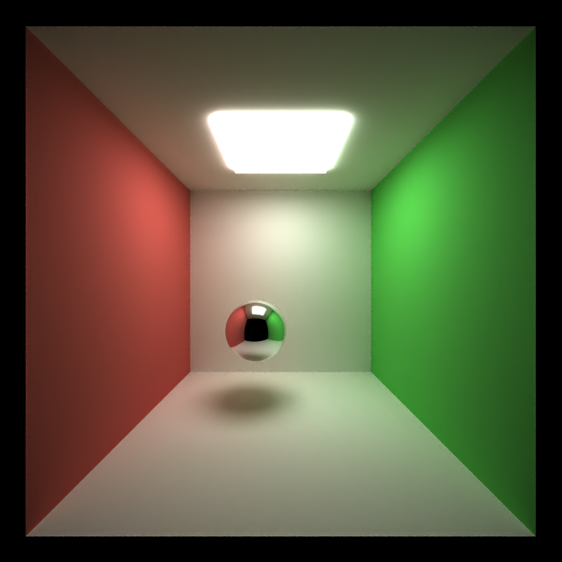
Pure Smooth Metalic Sphere Example

This BSDF is used for purely metallic/reflective materials, where the ray is perfectly reflected across the normal, and has a probability of 1 of happening (as there is only one possible output direction to sample). 
Due to this, we also forgo NEE/MIS here as they would not provide any additional information.

## Stochastic Sampled Antialiasing

With Antialiasing (no denoise)

Without Antialiasing (no denoise)

This is implemented by jittering the ray direction within each pixel to soften hard lines.

# Material Improvements

## Material Scatter Pipeline

When determining how to handle a specific material, the following branching path is used:
- If a material has a non-1 alpha, determines with probabilty (1 - alpha) to "phase through" this object and skip past it without bouncing.
- If material isn't pure smooth glass or metal (metallicFactor or transmissionFactor of 1 with 0 roughness), do NEE + MIS.
- If pure metal (metallic_factor=1), calculate reflection and return.
- If pure glass (transmission_factor=1), calculate transmission and return.
- If pure diffuse (no metallic or transmission factor), do standard cosine BSDF sampling and return.
- Otherwise, it is a mix, so based on the metallic factor and transmission factors, it randomly decides whether to use reflection, transmission, or diffuse.

## Microfacet GGX

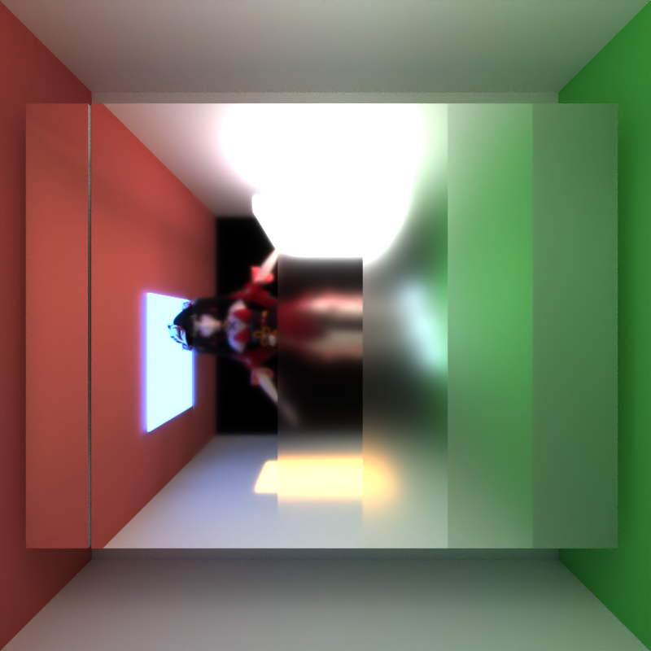
Here we have an example of pure metalics of varying roughness (smooth mirror to left, rough mirror to the right). We also have a sprite that is positioned behind the camera, so it is visible through the reflection.

This is used to implement rough metals and dielectrics. The goal is to mimic real life surfaces which are not perfectly smooth and have tiny microfacets in their surfaces, so reflections will not always go around the overall surface normal.
This works by creating a distribution of all possible normals, changing depending on the roughness, and then samples a normal `wm` from this distribution.
The main complication in logic here comes from making sure the pdf and brdf values are set accordingly depending on the likelyhood of reflecting along that specific normal, so nothing contributes too much or too little.
This combines the GGX normal distribution term `D`, the Smith masking-shadowing term `G`, and the Fresnel term `F`.

After sampling `wm`, the reflection (for metals and dielectrics) and refraction (for dielectrics) can then happen around this sampled normal `wm` instead, showing a form of rough glass or rough metal.

## Dielectrics/Refraction

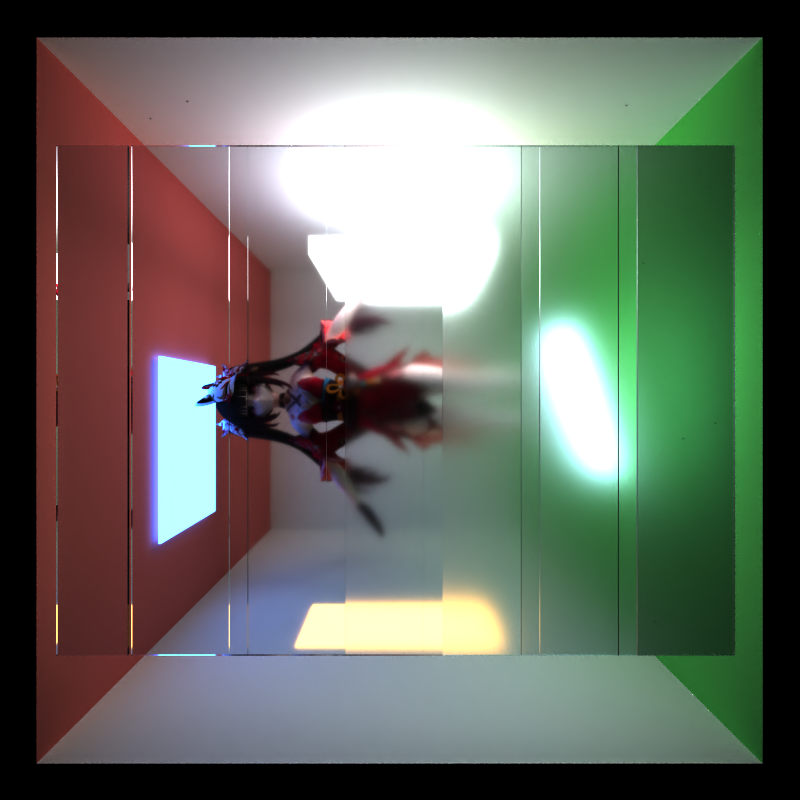
Dielectric surfaces increasing roughness (left smoothest, right roughest)

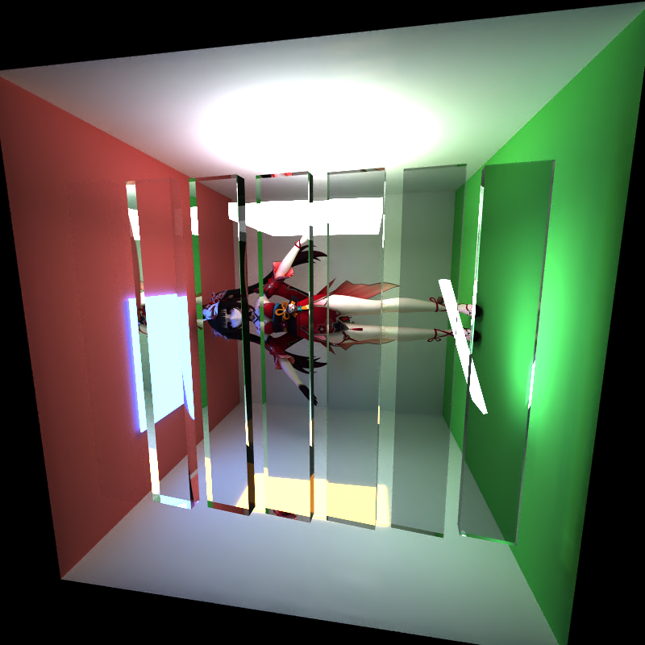
Dielectric surfaces of increasing IOR

The goal of this feature is to implement dielectric materials, such as glass and water. 
This works by taking the direction, the normal, and the Index of Refraction and determining an R value with fresnel's law (which is a number between 0 and 1). This represents the proportion of times we decide to reflect versus refract (using Snell'ss law) our ray (as dielectrics like glass sometimes reflect and sometimes refract).
If the dielectric is rough instead of perfectly smooth, reflection and refraction happen around the sampled normal `wm`. 
Depending on fresnels law and if it reflects or refracts, this also updates the pdf and brdf accordingly.

### Absorption-based volumetric tinting

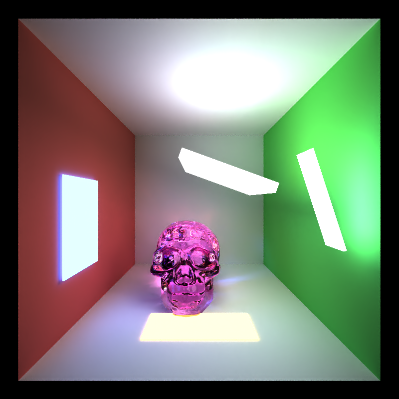
With high (pink) volumetric tinting

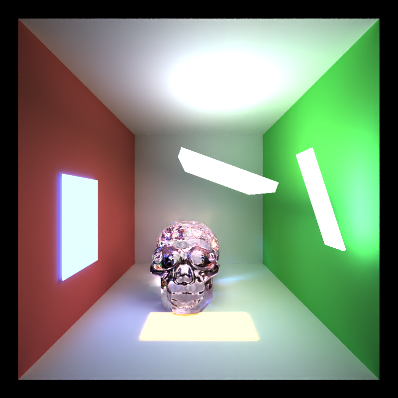
Without volumetric tinting

With dielectric materials, I implemented absorbtion based volumetric tinting as well. When entering a dielectric, it keeps track of what material it is inside (storing it in a field inside the PathSegment), with the default being air. Once it exits a dielectric, if it has a positive `attenuationDistance`, then it adds the `attenuationColor` with a strength corresponding to the total distance covered from when it entered compared to when it exited, with respect to the `attenuationDistance`. 
This also requies the material's `thicknessFactor` to be non-zero.
As this currenlty does not support proper volumetric scattering and is only basic attenuation, increasing the `thicknessFactor` further after non-zero does not have any effect.

This currenlty does not support nested dielectrics inside each other, as this would require maintaining a stack of which dielectrics you have entered and adjusting the color tinting according to Beer-Lambert's law. This only works for standalone dielectric objects.

## Next-Event Estimation

This uses direct light sampling to improve convergence when there are smaller lights. This works by first sampling an emissive triangle, with the weightage based on the area of this triangle with respect to the total area (calculated upon scene creation).
After getting this random triangle, it samples a random point on this light, and traces a shadow ray for visibility. This just detects if there is any geometry between the intersection point and this light and, if not, adds direct contribution for this light.
For weightage, this requires evaluating the BSDF towards the sampled light (to see how likely the light ray is to bounce in this direction) and calculalting a directional PDF using the area PDF.
This is skipped for perfect metallic and dielectric materials as there is no variation in their outgoing direction.
A limitation here is that it only works with emissive triangles, and not other emissive geometry or emission in the HDR Environment.

## Multiple Importance Sampling

This works by balancing the BSDF sampled light hits with the NEE light samples to further improve convergence rate when there are both bigger lights and smaller lights.
This works by calculating both the BSDF and the NEE contributions, and then using the power heuristic to get a final mixed result. 
This is also skipped for perfect metallic and dielectric mamterials as there is no variation in their outgoing direction.

## Alpha and Emissive Materials

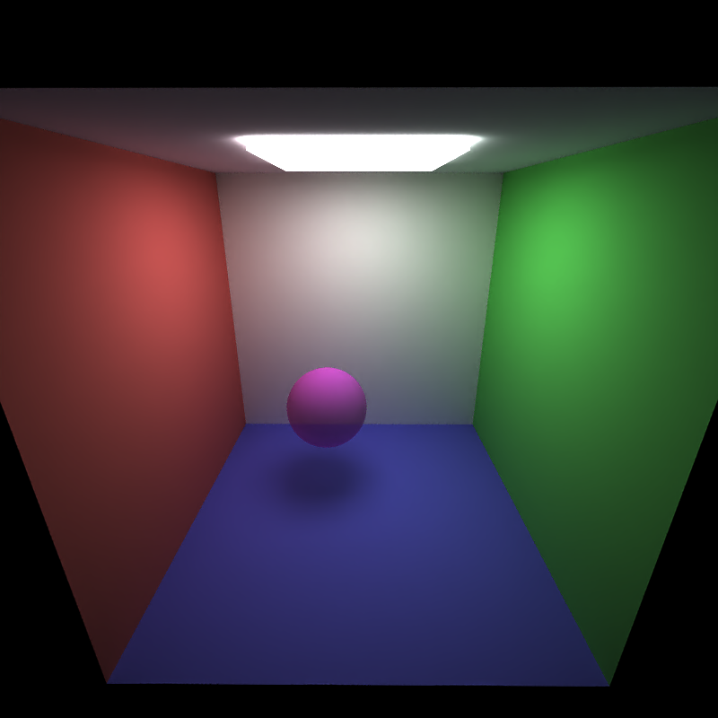
Alpha 0.3 Sphere

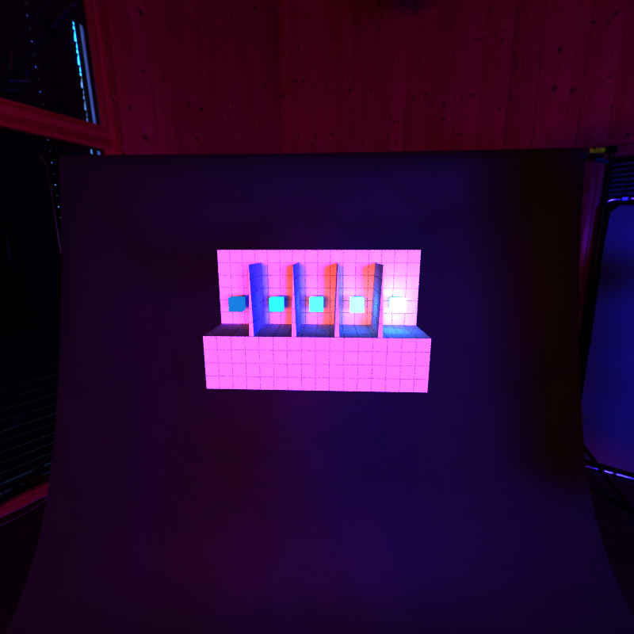
Emissive Triangles: emissive test sprite

To support different alpha values, I added an additional random sample between 0 and 1 for when the alpha is less than 1. I then continue as normal if the random number is less than the alpha, but if the value is greater than the alpha it will "phase through" the object. This happens by keeping the same direction but changing the origin slightly past the end of the object (with custom functions to determine this for non-triangle objects, i.e. the default spheres and rectangles). This essentially mimics a probability of the light "phasing thorugh" this object.

For emissive materials, when an emissive triangle is hit, it reacts like any normal material but also adds a factor to the radiance corresponding to the `throughput * emissive_factor`, causing this path to add illumination to the image. This is additionally MIS-weighted against light-sampling PDF if applicable.

# Mesh Improvements

## glTF/GLB Loading

To support arbitrary meshes, I implemented glTF/GLB loading via a third party library tinyglTF. This parses out a glTF/GLB file into a special format tinyglTFv3, which I then converted to my `Scene` format by parsing data out from their special format.
This also supports compound scene formats by using the pre-existing JSON scenes, but adding a type as `"MESH"` and `"FILE"` field as the path to the glTF/GLB file, and can be given a transform/rotation/scale.

For loading the glTFs, it goes through 3 steps:
- First, it parses all the textures (if applicable) out of the file and loads it into the total textures list.
- Next, it parses all the materials and loads it into the total materials list.
- Lastly, it parses all the geometry (generally triangles) and laods it into the triangles list.

The following features are supported and parsed into `Material`:
- base color factor
- alpha + alpha mode (with the alpha behavior described above)
- metallic_factor
- roughness_factor
- emissive_factor
- double_sided
- base color texture ID
- metallic-roughness texture ID
- emissive texture ID
- normal texture ID
- KHR_materials_emissive_strength
- KHR_materials_ior: ior
- KHR_materials_volume: thickness, attenuation_color, attenuation_distance
- KHR_materials_transmission: transmission_factor
These features are all parsed from the tinygltf object into the internal `Material` object for use throughout the pathtracer.

## Texturing

The arbitrary glTF meshes also supports custom texture importing.
At a high level, the workflow is the following:

Loading:
1. When loading glTF/GLB materials, parse associated texture idx for base color, metallic roughness, emissive, and normal maps.
2. Load the specified image files into host arrays (from buffers in the tinygltf GLB or external images for the glTF).
3. Upload all textures to GPU as DeviceTexture objects

During pathtracing:
1. During triangle intersection, determine uv coordinates of hit with baryocentric interpolation of each vertex uv.
2. In computeRayColors, sample the texture associated with this triangle at that uv.
3. Combine the sampled texture value with constants (i.e. for color, `baseColorFactor * baseColorTexture (sampled)`).
4. Use sRGB decoding for base color and emissive textures

## HDR Environment

glTF texture with environment (no cornell box)

Added additional support for HDR textures and, if environment map is enabled and an environment map is specified, loads in the HDR texture as the 0th texture (pushing all other textures back by one).
After this everytime we have a path with no intersection (meaning it exits into the environment), we convert the direction into a `u` and `v` coordinate and sample that from the 0th texture (which corresponds to this HDR texture) and renders this background as such.
While it also therefore supports emissive textures in the background, it currenlty does not add these to the global illumination list and is not supported by NEE, so bright features will converge slower.

# Other Improvements

## Intel Open Image Denoiser (GPU)

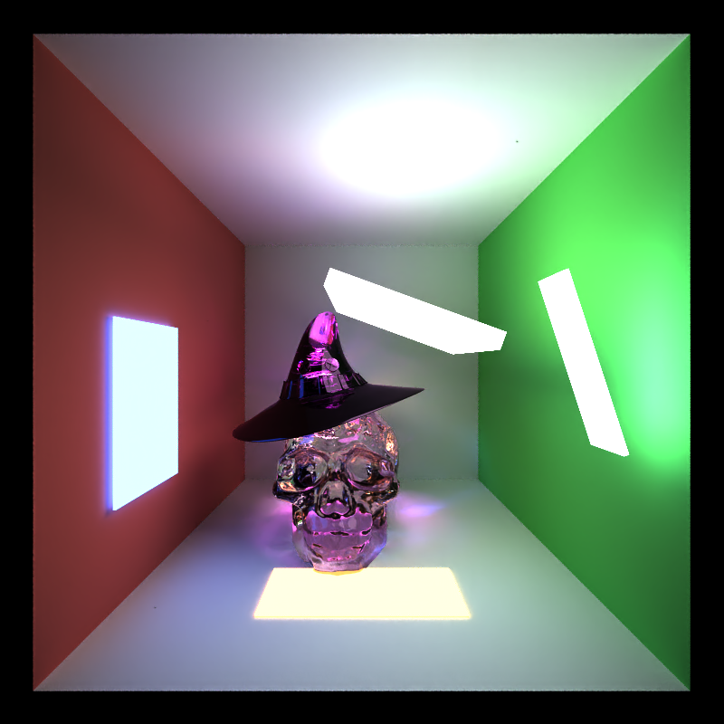
With Denoiser

Without Denoiser

This is an open source ML-based image denoiser optimized to reduce monte-carlo pathtracer noise. It takes as input the following 3 buffers:
- **Beauty:** The accumulated color (combined radiance * throughput / number of iterations).
- **Normal:** The normal of the very first intersection from each pixel, with (0, 0, 0) if there is no intersection.
- **Albedo:** The base color of the material of the very first intersection from each pixel, with -1 if there is no intersection.

After completing the entire pathtrace for all 5000 iterations and before saving, this data is passed in as device buffers into the GPU (CUDA-backed) OID Denoiser, and outputs a denoised device buffer which we save instead of the raw beauty buffer.

Due to size this entire denoiser was not commited into this repo, but it can be downloaded and copied directly with no changes into the `denoiser/` directory to get working.

# Performance Analysis

## BVH Tree Acceleration

This was primarily added to accelerate triangle intersection tests for big glTF meshes.
It is worth noting that non-triangle objects (created directly with the scene JSON) are not included in this BVH and are tested via brute force, as the primary slowdown I had was with the big triangle-based meshes.

Here is a table demonstrating the performance improvement using varying numbers of Glass Skulls in a cornell box.
| Triangle Count | BVH FPS | No BVH FPS | Performance Increase |
|---------------:|--------:|-----------:|--------:|
| 73.6k          | 30.0    | 0.0240     | 1250.0x | 124,900%             |
| 147k           | 24.0    | 0.0139     | 1726.6x | 172,561.9%           |
| 220.8k         | 20.4    | 0.0089     | 2292.1x | 229,113.5%           |

### CPU Construction

After scene loading, the BVH tree is constructed using the CPU (as this is a one time cost, so it is acceptable to incur a higher initial cost for simplicity of implementation). This is only constructed on the triangles for the scene, as this is primarily necessary for accelerating big meshes (comprised of triangles).

This construction recursively does the following:
1. Determines the longest AABB axis, and determines the midpoint of this axis.
2. Partition all the triangles in place around this midpoint by the centroid.
3. Constructs 2 children nodes corresponding to either side of this axis, and then notes the starting index and count of triangles for that half.
4. Recurse until triangle count <= 2 (which makes this a leaf).
This partition is done in place to allow for efficient storing of nodes, as each one then only needs to store a start index and count for triangles and, when checking for intersections, the triangles in a node are then stored sequentially in memory.

### GPU Traversal

When switching over to the pathtracing kernels, the BVH nodes list and triangles list (in the new order) are Memcopy'd over to device vectors. This means that we can then traverse down the BVH nodes (if each one stores their children nodes) and determine which traingles are in each one in the GPU.

The GPU traversal for intersection testing does the following, starting with the root node:
- If not leaf node, Compare the child AABBs with this ray and start with the closer child. Push the farther child onto the stack.
- If leaf node, test all contained triangles and determine the tMin.
- When checking AABBs after finding a tMin, if these nodes have an AABB greater distance than tMin, then skip this node.
It is worth noting that this Intersection test uses an explicit fixed-stack size of memory on the GPU instead of using recursion for efficiency.

## Russian Roulette Path Termination

This is an optimization that improves performance when we have higher max_depth and have many low-throughput paths. It works by, after the third bounce, terminating all paths with a throughput lower than a specific threshold. Since these would only contribute a very small portion to the overall image, this allows us to converge to the same image (with slightly higher variance) while reducing the number of bounces with negligable impact on the image.
To maintain unbiasedness, the surviving paths divide their throughput by the survival probability as well.

Here is a graph of performance compared to depth.
| Max Depth | With RR FPS | Without RR FPS | Percent Improvement |
|----------:|------------:|---------------:|--------------------:|
| 8         | 17.0        | 17.0              | 0.0%                   |
| 10        | 13.66       | 14.9           | -8.32%              |
| 12        | 12.3        | 13.0           | -5.38%              |
| 16        | 11.2        | 9.6            | +16.67%              |

As we see here, at lower depths, Russian Roulette performs worse due to extra overhead, but as we increase depth (as seen especially with 16), the performance increase gotten by terminating these paths early outweighs the cost and improves performance.

## Stream Compacted Path Termination

This optimization happens after calculating intersections before shading. If material-based sorting is off, it works by using thrust's `copy_if` command with temporary buffers for PathSegments and Intersections, where it copies each to the corresponding alternate buffers (maintaining the same order) if they are active paths, stream compacting into an alternate buffer and returning the number of elements in the new buffer. It also ping pongs these buffers for efficiency.
This optimization then makes sure that we only `computeRayColors` (call the shader) if this is an active path with an intersection, and makes sure they are all sequential in memory.

## Material-based Sorting

This optimzation happens after calculating intersections before shading, and if turned on happens together with Stream Compaction. This first maps all materialIds associated with each Segment/Intersection to 2 temp buffers (setting materialId to -1 if path is dead for Stream Compaction), and then uses thrust's `stable_sort_by_key` to sort both by material. 
After this, it calls a kernel to determine the first element that isn't terminated (has a non-negative material id), and signifies this as the start of the new buffer for our segments and intersections, stream compacting out the termianted paths.

Sorting by material introduces additional overhead cost, but with many differing materials with computationally expensive shading, this can reduce a lot of the warp divergence that would otherwise happene with interwoven material types.

Performance without Material Sorting on thumbnail render: 14.6 FPS

Performance with Material Sorting on thumbnail render:
14.9 FPS

Here we observe that, even though there is some overhead in sorting, even in a scene with only 2 objects, lights, and the cornell box we end up with a 2% performance increase. If we add more materials in our scene, we can observe that this percent will increase (as there is increased chance of warp divergence otherwise), and if the scene has less materials then the performance increase will be smaller (with potentially having material sorting perform worse in some cases).

# Other Cool Images
### First Smooth Glass Render
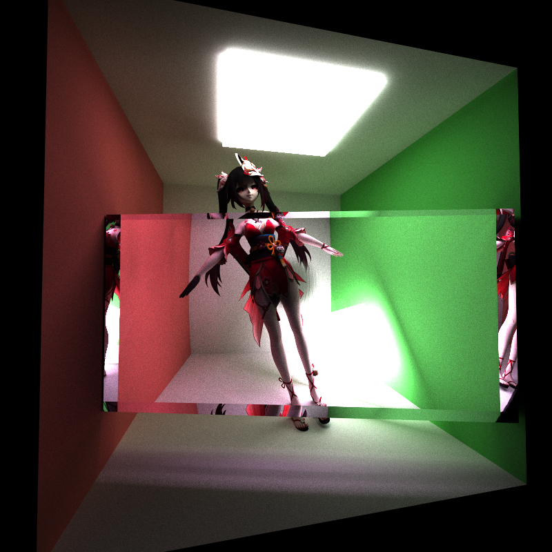

### First Rough Glass Render
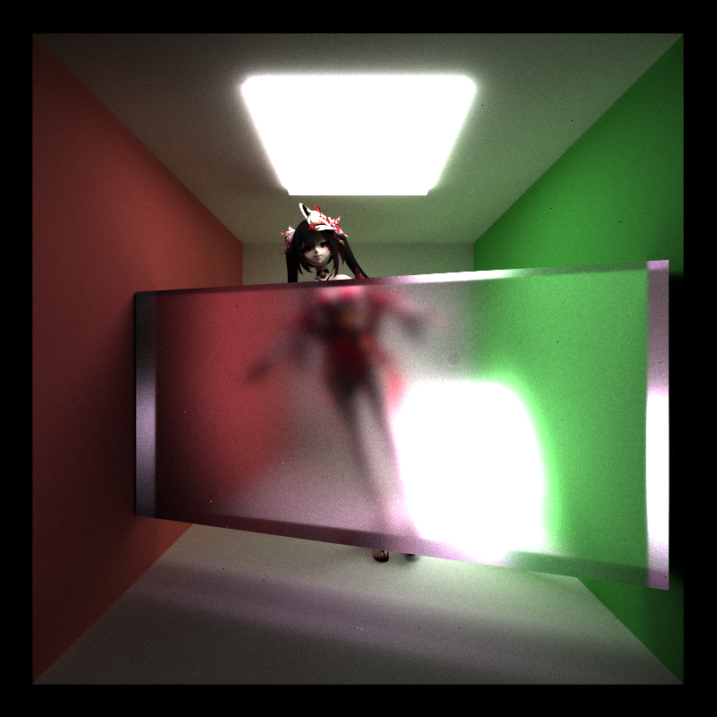

### First Glass Skull Renders

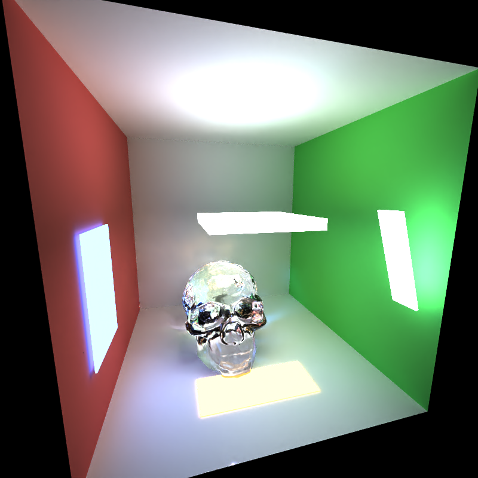
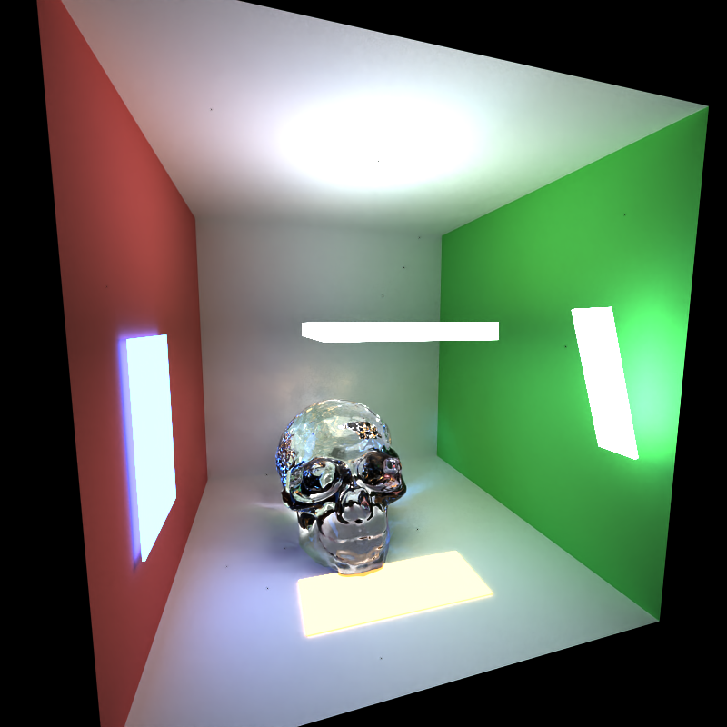

# References

### Resources
- [PBRT v4](https://www.pbr-book.org/3ed-2018/contents)
- [jbikker's How to build a BVH](https://jacco.ompf2.com/2022/04/13/how-to-build-a-bvh-part-1-basics/)
- glTF 2.0 specification
- Open Image Denoise Documentation
- tinyglTF

### Textures and Meshes
- [Sparkle (Sketchfab)](https://sketchfab.com/3d-models/sparkle-star-rail-7757dd1b6bcf4559ae08fd1004c12f31)
- [Glass Skull (Sketchfab)](https://sketchfab.com/3d-models/glass-skull-2ae73736baa34083860880ea1cd92978)
- [Megumin's Hat (Sketchfab)](https://sketchfab.com/3d-models/megumins-hat-aac68a65adac4c69a8b0ed15ffd5ef3e)
- [Wooden Studio HDR (polyhaven)](https://polyhaven.com/a/wooden_studio_10)
- [Emissive Triangle Test (KhronosGroup)](https://github.com/KhronosGroup/glTF-Sample-Assets/blob/main/Models/EmissiveStrengthTest/README.md)